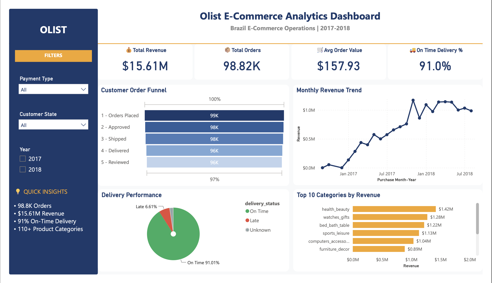

# 📊 Olist E-Commerce Analytics Dashboard

## 📌 Overview

This project presents an interactive Power BI dashboard built using the Olist Brazilian E-Commerce dataset. The dashboard provides insights into sales performance, customer orders, delivery efficiency, and product categories.

---

## 🖼 Dashboard Preview

---

## 🎯 Objectives

- Analyze total revenue and orders
- Monitor monthly revenue trends
- Evaluate order fulfillment stages
- Track delivery performance
- Identify top-performing product categories

---

## 🛠 Tools & Technologies

- Power BI
- Power Query
- DAX
- SQL (MySQL)
- Python (Pandas)
- GitHub

---

## 📈 Dashboard Features

- 💰 Total Revenue KPI
- 📦 Total Orders KPI
- 🛒 Average Order Value
- 🚚 On-Time Delivery %
- 📊 Order Fulfillment Funnel
- 📈 Monthly Revenue Trend
- 🍩 Delivery Performance
- 📦 Top 10 Categories by Revenue
- 🎛 Interactive Filters (Payment Type, Customer State, Year)

---

## 💡 Key Insights

- Generated **$15.61M** in total revenue.
- Processed **98K+ customer orders**.
- Achieved an **on-time delivery rate of 91%**.
- Health & Beauty was the highest revenue-generating category.
- Revenue showed consistent growth during 2017–2018.

---

## 📂 Repository Contents

- `Olist_Ecommerce_Analytics_Dashboard.pbix`
- `Dashboard.pdf`
- `dashboard.png`
- `cleaned_master.csv`
- `funnel_data.csv`

---

## 👩‍💻 Author

**Hebah**
